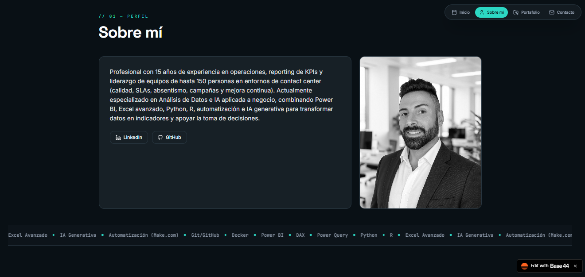

# 🚀 Portfolio migueljerico · base44

<p align="left">
  
  
  
  
  
  
</p>

*Portfolio personal de **@migueljerico** — single‑page application construida con React 18, Vite, TailwindCSS y desplegada en **Base44**. Muestra proyectos, habilidades y experiencia profesional en el ámbito de análisis de datos e IA.*

---

## 📸 Vista previa del Portfolio



---

## 🔗 Acceso / Demo

🌐 **Sitio en producción:** [https://jerico-data-flow.base44.app](https://jerico-data-flow.base44.app)

---

## 📋 Descripción

Este repositorio contiene el código fuente del portfolio personal de **Miguel Jericó Díaz**, desarrollado como parte de su transición profesional hacia perfiles de **Análisis de Datos e Inteligencia Artificial aplicada al negocio**. La web actúa como carta de presentación digital, combinando más de 15 años de experiencia en operaciones y liderazgo de equipos con competencias técnicas modernas (Power BI, Python, R, automatización e IA generativa).

A diferencia de otros proyectos del portfolio que se centran en ejercicios de análisis de datos, esta web pone el foco en la **capa de producto y frontend**: arquitectura de componentes, diseño de interacción, navegación por anclas, modo oscuro, barra de progreso de scroll y paleta de comandos tipo `Cmd+K`. Está pensada para **reclutadores técnicos, colaboradores potenciales y cualquier persona interesada** en conocer de un vistazo las capacidades técnicas y la trayectoria del autor.

---

## ✨ Funcionalidades

| Funcionalidad | Descripción |
|---|---|
| 🏠 **Página de inicio (Hero)** | Presentación profesional con foto, nombre, rol y eslogan personal. |
| 👤 **Sección "Sobre mí"** | Biografía, experiencia, formación y valores profesionales. |
| 💼 **Portafolio de proyectos** | Galería de proyectos con tarjetas (`PortfolioCard`) que incluyen descripción y tecnologías. |
| 🛠️ **Stack tecnológico** | Visualización de herramientas, lenguajes y frameworks dominados. |
| 📬 **Formulario de contacto** | Canal directo para recibir mensajes (integrado con Base44). |
| 📱 **Diseño responsive** | Adaptación completa a móviles, tablets y escritorio. |
| 🌙 **Modo oscuro** | Conmutador de tema claro/oscuro con persistencia en el navegador. |
| ⚡ **Barra de progreso de scroll** | Indicador visual de la posición de lectura (`ScrollProgress`). |
| ⌨️ **Paleta de comandos** | Acceso rápido a secciones mediante `Ctrl+K` (`CommandBar`). |
| 🔐 **Autenticación Base44** | Andamiaje completo de login, registro, recuperación de contraseña y rutas protegidas (listo para futuras áreas privadas). |

---

## ⚙️ Instalación

Sigue estos pasos para levantar el proyecto en tu entorno local:

1. **Clonar el repositorio**
   ```bash
   git clone https://github.com/migueljerico/portfolio-migueljerico-base44.git
   cd portfolio-migueljerico-base44
   ```

2. **Instalar dependencias**
   ```bash
   npm install
   ```

3. **Configurar variables de entorno**
   ```bash
   cp .env.example .env
   # Edita .env con tus credenciales de Base44 (API key, etc.)
   ```

4. **Iniciar el servidor de desarrollo**
   ```bash
   npm run dev
   ```

5. **Abrir el navegador** en `http://localhost:3000` (o el puerto que indique Vite).

---

## 🚀 Uso

Una vez ejecutado el servidor de desarrollo, la aplicación se renderiza como una **single‑page application** con navegación por anclas. La estructura modular permite personalizar cada sección editando los archivos correspondientes en `src/components/portfolio/`. Por ejemplo, para modificar el contenido del Hero:

```jsx
// src/components/portfolio/Hero.jsx
export default function Hero() {
  return (
    <section id="inicio">
      <h1>Miguel Jericó Díaz</h1>
      <p>Data & IA Analyst</p>
    </section>
  );
}
```

Para añadir un nuevo proyecto al portafolio, edita el array de proyectos (por ejemplo, en `src/data/projects.js`):

```javascript
export const projects = [
  {
    title: "Mi proyecto destacado",
    description: "Descripción breve.",
    tech: ["React", "Node.js", "PostgreSQL"],
    link: "https://github.com/migueljerico/proyecto",
  },
];
```

La paleta de comandos (`CommandBar`) se activa con `Ctrl+K` y permite navegar rápidamente entre secciones. La barra de progreso de scroll (`ScrollProgress`) se muestra en la parte superior de la página.

---

## 📁 Estructura del proyecto

```
portfolio-migueljerico-base44/
├── README.md
├── MANUAL_TECNICO.md
├── docs/
│   └── Portfolio_Jerico_Data_Flow_Miguel_Jerico.md
├── public/
│   └── (archivos estáticos, favicon, etc.)
├── src/
│   ├── api/
│   │   └── base44Client.js          # Integración con backend de Base44
│   ├── components/
│   │   ├── portfolio/               # Componentes específicos del sitio público
│   │   │   ├── Hero.jsx
│   │   │   ├── About.jsx
│   │   │   ├── Portfolio.jsx
│   │   │   ├── PortfolioCard.jsx
│   │   │   ├── Contact.jsx
│   │   │   ├── Footer.jsx
│   │   │   ├── CommandBar.jsx
│   │   │   └── ScrollProgress.jsx
│   │   └── ui/                      # Componentes transversales / autenticación
│   │       ├── AuthLayout.jsx
│   │       ├── ProtectedRoute.jsx
│   │       └── GoogleIcon.jsx
│   ├── hooks/
│   │   ├── use-mobile.jsx           # Detección de breakpoint móvil
│   │   ├── use-size.jsx             # Hook genérico de tamaño
│   │   └── ...
│   ├── pages/
│   │   ├── Home.jsx                 # Página principal renderizada
│   │   ├── Login.jsx                # Generada por Base44
│   │   ├── Register.jsx
│   │   ├── ForgotPassword.jsx
│   │   └── ResetPassword.jsx
│   ├── App.jsx                      # Router + layout
│   ├── main.jsx                     # Punto de entrada
│   └── index.css                    # Estilos globales
├── components.json                  # Configuración de shadcn/ui
├── vite.config.js                   # Configuración de Vite
├── tailwind.config.js               # Configuración de TailwindCSS
├── postcss.config.js                # PostCSS plugins
└── package.json
```

---

## 🛠️ Tecnologías

| Herramienta | Versión / Detalle | Uso en el proyecto |
|---|---|---|
| **React** | 18.x | Framework UI principal: renderizado de componentes, estado, composición. |
| **Vite** | 5.x | Bundler y servidor de desarrollo con HMR ultrarrápido. |
| **TailwindCSS** | 3.x | Sistema de utilidades CSS para diseño responsive y personalización de temas. |
| **shadcn/ui** | Configuración en `components.json` | Primitivas UI reutilizables (botones, inputs, tarjetas). |
| **Base44** | BaaS (Backend as a Service) | Generación de código base, autenticación, almacenamiento y despliegue. |
| **Node.js** | ≥ 18.x | Entorno de ejecución para herramientas de build. |
| **npm** | ≥ 9.x | Gestión de dependencias y scripts. |
| **Git** | 2.x+ | Control de versiones. |

---

## 📚 Contexto formativo o motivación del proyecto

Este proyecto nace con la motivación de **consolidar la marca personal** de Miguel Jericó en la web, sirviendo como carta de presentación digital durante su transición profesional hacia perfiles de análisis de datos e IA. La elección de **Base44** como plataforma BaaS responde al deseo de contar con un *starter* moderno que incluya autenticación, despliegue automático y una base de código limpia.

Además, el proyecto funciona como **lienzo de aprendizaje** para experimentar con patrones de diseño modernos (arquitectura de componentes, hooks personalizados, navegación por anclas, paleta de comandos) y prácticas de despliegue continuo, manteniendo un producto real (el propio portfolio) como vehículo de mejora continua.

---

<p align="center">Creado por @migueljerico y documentado por BazaarLink (DeepSeek V4 Flash (free)) · 2026</p>
